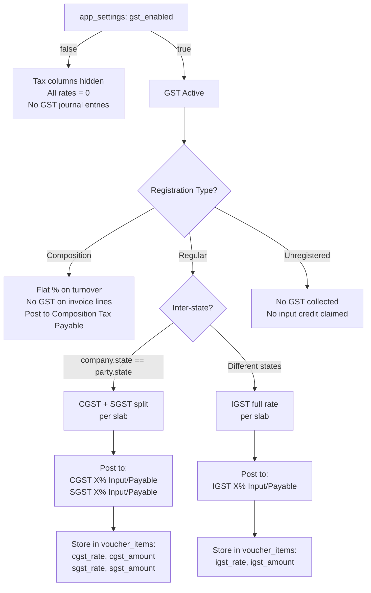

# GST Compatibility — Implementation Plan _(Revised)_

## Background

Kola-biz currently stores transactions without any tax data. The goal is to add **full India GST
compliance** — CGST / SGST / IGST split, HSN/SAC codes on products, configurable GST slabs,
party GSTIN, Composition Scheme support, IRN placeholder, and a global enable/disable toggle in
Settings. The old generic `tax_rate` / `tax_amount` columns on `voucher_items` are **deprecated
(not removed)** — new vouchers use the CGST/SGST/IGST columns exclusively.

---

## Decisions Made (from your feedback)

| Topic | Decision |
|-------|----------|
| GST Slabs | **0%, 5%, 18%, 40%** only |
| GSTIN / State storage | Stored in **`customers` / `suppliers` tables** (entered at party creation) and synced to `chart_of_accounts` |
| COA account naming | **Per-slab named accounts** e.g. `CGST 9% Payable`, type = **Duties & Taxes** (sub-group of Current Liabilities / Current Assets) |
| Composition Scheme | **Supported** |
| E-Invoice / IRN | **IRN placeholder field added** |
| TCS/TDS | **Skipped** for now |
| Tax-inclusive pricing | **Global setting** in Tax Settings page (user-selectable) |
| Invoice template | **New Tax Invoice template** — format to be provided by user separately |
| Template context | Each **line item** gets its own CGST/SGST/IGST amounts **plus** full header totals (cgst_total, sgst_total, igst_total) |
| Legacy transactions | No migration needed — all existing transactions have no tax records |
| Price-based GST | **Supported** — products can have two slabs that switch based on a price threshold (e.g. apparel < ₹2500 → 5%, ≥ ₹2500 → 18%) |

---

## Proposed Changes

### 1 — Database / Schema (`db.rs`)

#### [MODIFY] [db.rs](file:///d:/MunnaProjects/Kola-biz/src-tauri/src/db.rs)

**New table — GST Tax Slabs:**

```sql
CREATE TABLE IF NOT EXISTS gst_tax_slabs (
    id          TEXT PRIMARY KEY,
    name        TEXT NOT NULL,     -- e.g. "GST 5%"
    rate        REAL NOT NULL,     -- total rate: 5.0
    cgst_rate   REAL NOT NULL,     -- half: 2.5
    sgst_rate   REAL NOT NULL,     -- half: 2.5
    igst_rate   REAL NOT NULL,     -- full: 5.0 (inter-state)
    is_active   INTEGER DEFAULT 1,
    created_at  DATETIME DEFAULT CURRENT_TIMESTAMP
);

-- Seeded slabs (0%, 5%, 18%, 40%)
INSERT OR IGNORE INTO gst_tax_slabs VALUES
  ('gst_0',  'GST 0%',   0,  0,    0,    0),
  ('gst_5',  'GST 5%',   5,  2.5,  2.5,  5),
  ('gst_18', 'GST 18%', 18,  9.0,  9.0, 18),
  ('gst_40', 'GST 40%', 40, 20.0, 20.0, 40);
```

**Column additions via ALTER TABLE migrations:**

| Table | New Column | Purpose |
|-------|-----------|----------|
| `products` | `hsn_sac_code TEXT` | HSN (goods) or SAC (services) code |
| `products` | `gst_slab_id TEXT` | Default GST slab (used when price-based is off) |
| `products` | `gst_price_based INTEGER DEFAULT 0` | Enable price-threshold slab switching |
| `products` | `gst_price_threshold REAL` | Price threshold (e.g. 2500.0) |
| `products` | `gst_below_threshold_slab_id TEXT` | Slab when sale price **< threshold** (e.g. GST 5%) |
| `products` | `gst_above_threshold_slab_id TEXT` | Slab when sale price **≥ threshold** (e.g. GST 18%) |
| `customers` | `gstin TEXT` | Customer GSTIN (entered at creation) |
| `customers` | `state TEXT` | Customer state |
| `suppliers` | `gstin TEXT` | Supplier GSTIN |
| `suppliers` | `state TEXT` | Supplier state |
| `chart_of_accounts` | `gstin TEXT` | Synced from customers/suppliers |
| `chart_of_accounts` | `state TEXT` | Synced from customers/suppliers |
| `voucher_items` | `cgst_rate REAL DEFAULT 0` | CGST rate applied |
| `voucher_items` | `sgst_rate REAL DEFAULT 0` | SGST rate applied |
| `voucher_items` | `igst_rate REAL DEFAULT 0` | IGST rate applied |
| `voucher_items` | `cgst_amount REAL DEFAULT 0` | CGST amount per line |
| `voucher_items` | `sgst_amount REAL DEFAULT 0` | SGST amount per line |
| `voucher_items` | `igst_amount REAL DEFAULT 0` | IGST amount per line |
| `voucher_items` | `hsn_sac_code TEXT` | HSN/SAC snapshot at invoice time |
| `voucher_items` | `gst_slab_id TEXT` | Slab used (for reports) |
| `vouchers` | `irn TEXT` | E-Invoice Reference Number (manual entry) |
| `vouchers` | `irn_date DATE` | Date of IRN generation |

> [!IMPORTANT]
> **Price-Based GST Rule (Apparel / Footwear)**: India's GST council applies different rates
> based on the item's sale value. Example: Footwear < ₹1000 → 5%, ≥ ₹1000 → 12%. Apparel/made-ups
> < ₹1000 → 5%, ≥ ₹1000 → 12%. Any product can be configured with a custom threshold.
> The invoice engine reads `gst_price_based` flag and chooses the slab automatically.

> [!NOTE]
> The old `tax_rate` / `tax_amount` columns on `voucher_items` are retained in the schema but
> **ignored for new vouchers**. New vouchers populate CGST/SGST/IGST columns only.

**New GST COA Accounts — auto-seeded per slab:**

For each active slab, we seed **output (Payable)** and **input (Credit)** accounts with
`account_group = 'Duties and Taxes'`.

| Account Code | Account Name | Group | Type |
|-------------|-------------|-------|------|
| GST-CGST-P-5 | CGST 2.5% Payable | Duties & Taxes | Current Liability |
| GST-SGST-P-5 | SGST 2.5% Payable | Duties & Taxes | Current Liability |
| GST-IGST-P-5 | IGST 5% Payable | Duties & Taxes | Current Liability |
| GST-CGST-P-18 | CGST 9% Payable | Duties & Taxes | Current Liability |
| GST-SGST-P-18 | SGST 9% Payable | Duties & Taxes | Current Liability |
| GST-IGST-P-18 | IGST 18% Payable | Duties & Taxes | Current Liability |
| GST-CGST-P-40 | CGST 20% Payable | Duties & Taxes | Current Liability |
| GST-SGST-P-40 | SGST 20% Payable | Duties & Taxes | Current Liability |
| GST-IGST-P-40 | IGST 40% Payable | Duties & Taxes | Current Liability |
| GST-CGST-I-5 | CGST 2.5% Input Credit | Current Assets | Asset |
| GST-SGST-I-5 | SGST 2.5% Input Credit | Current Assets | Asset |
| GST-IGST-I-5 | IGST 5% Input Credit | Current Assets | Asset |
| _(same for 18% and 40%)_ | … | … | … |

> [!NOTE]
> **Duties & Taxes** is the standard Indian accounting group for GST accounts. Output tax
> (Payable) sits under **Current Liabilities → Duties & Taxes**. Input credit sits under
> **Current Assets → Loans & Advances / Tax Credits**. Seeds will create these using existing
> `account_group` values in your COA. `is_system = 1` so they are protected from deletion.

---

### 2 — Backend Rust (`src-tauri/src/commands/`)

#### [NEW] `tax.rs` — GST Slab CRUD + Report Queries

Commands:
- `get_gst_tax_slabs` — list all slabs
- `create_gst_tax_slab` — add custom slab
- `update_gst_tax_slab` — handles future rate changes (e.g. 5% → 6%)
- `delete_gst_tax_slab` — soft delete (prevents deleting slabs in use)
- `get_gstr1_summary(from_date, to_date)` — outward supplies grouped by HSN + rate
- `get_gstr3b_summary(from_date, to_date)` — net output vs input credit

#### [NEW] `tax_utils.rs` — Shared GST Calculation Helper

```rust
pub struct GstSplit {
    pub cgst_rate: f64,   pub cgst_amount: f64,
    pub sgst_rate: f64,   pub sgst_amount: f64,
    pub igst_rate: f64,   pub igst_amount: f64,
}

pub fn split_gst(
    is_inter_state: bool,
    slab: &GstTaxSlab,
    taxable_amount: f64,
) -> GstSplit { ... }

pub async fn is_inter_state(
    tx: &mut Transaction<'_, Sqlite>,
    party_id: &str,
) -> Result<bool, String> {
    // compare company_profile.state vs chart_of_accounts.state for party
}

pub async fn resolve_gst_accounts(
    tx: &mut Transaction<'_, Sqlite>,
    slab_id: &str,
    is_inter_state: bool,
    is_purchase: bool,  // true = Input accounts, false = Payable accounts
) -> Result<GstAccounts, String> { ... }
```

#### [MODIFY] `products.rs`

- Add to `CreateProduct` / `Product`:
  - `hsn_sac_code: Option<String>`
  - `gst_slab_id: Option<String>`
  - `gst_price_based: bool` (default false)
  - `gst_price_threshold: Option<f64>`
  - `gst_below_threshold_slab_id: Option<String>`
  - `gst_above_threshold_slab_id: Option<String>`
- Update INSERT, UPDATE, and SELECT queries accordingly.

#### [MODIFY] `parties.rs`

- Add `gstin: Option<String>` and `state: Option<String>` to customer/supplier create/update.
- On save: write to both `customers`/`suppliers` table **and** sync to `chart_of_accounts`.

#### [MODIFY] `invoices.rs` + `sales_returns.rs` + `purchase_returns.rs`

**Updated invoice save flow:**
1. Read `gst_enabled` from `app_settings`.
2. If **disabled** → all GST fields = 0, skip all GST journal entries.
3. If **enabled**:
   - Read `gst_registration_type` (`Regular` / `Composition` / `Unregistered`).
   - Load company state from `company_profile`.
   - Load party state from `chart_of_accounts` (synced from customer/supplier).
   - Detect inter-state: `company_state != party_state` → IGST; else CGST+SGST.
   - **Composition mode**: no GST collected from customer; post flat composition tax (% of turnover) to a separate `Composition Tax Payable` account. No per-item split.
   - **Regular mode**: for each line item:
     1. Load product's GST configuration.
     2. **Resolve effective slab**:
        ```
        if product.gst_price_based && product.gst_price_threshold is set:
            if item.rate < product.gst_price_threshold:
                slab = product.gst_below_threshold_slab_id
            else:
                slab = product.gst_above_threshold_slab_id
        else:
            slab = line_item.slab_override ?? product.gst_slab_id
        ```
     3. Call `split_gst(is_inter_state, slab, taxable_amount)`.
     4. Store 6 GST columns in `voucher_items` + `gst_slab_id` used.
     5. Post to slab-specific COA accounts (CGST/SGST or IGST).
4. Add `irn` and `irn_date` to voucher header if provided.

#### [MODIFY] `settings.rs`

- `get_gst_settings()` → reads these keys from `app_settings`:
  - `gst_enabled` (true/false)
  - `gst_registration_type` ("Regular" / "Composition" / "Unregistered")
  - `gst_tax_inclusive` (true/false — global tax-inclusive pricing toggle)
  - `composition_rate` (flat % for composition dealers)
- `save_gst_settings()` → upserts all above.

#### [MODIFY] `mod.rs`

- Register new `tax` module and commands.

#### [MODIFY] `lib.rs`

- Add new commands to Tauri `.invoke_handler`.

---

### 3 — Frontend (`src/`)

#### [NEW] `src/pages/settings/TaxSettingsPage.tsx`

A new Settings page with these sections:

**Section 1 — GST Configuration**
- Master toggle: **Enable GST** (on/off)
- Registration Type: `Regular` / `Composition` / `Unregistered`
- If Composition: input for **Composition Rate %**
- Tax Pricing Mode: **Tax Exclusive** (default) / **Tax Inclusive** toggle

**Section 2 — GST Slabs Manager**
- Table: Name, Total Rate, CGST%, SGST%, IGST% (inter-state)
- Add / Edit / Deactivate slab rows
- Default seeded: 0%, 5%, 18%, 40%

**Section 3 — GST Accounts Overview** (read-only)
- Lists all auto-seeded Payable and Input Credit accounts per slab
- Link to Chart of Accounts for editing

#### [MODIFY] `src/pages/ProductsPage.tsx`

- Add **HSN/SAC Code** field (text input + description tooltip).
- Add **GST Mode** toggle: `Simple` (single slab) | `Price-Based` (threshold).
  - **Simple mode**: Default GST Slab selector.
  - **Price-Based mode**:
    - Threshold amount (₹)
    - Slab for price **below** threshold (e.g. GST 5%)
    - Slab for price **above or equal** threshold (e.g. GST 18%)
    - Example hint: `"Apparel: < ₹1000 → 5%, ≥ ₹1000 → 12%"`

#### [MODIFY] `src/pages/CustomersPage.tsx` + `SuppliersPage.tsx`

- Add **GSTIN** field with format validation (`^\d{2}[A-Z]{5}\d{4}[A-Z]{1}[A-Z\d]{1}[Z]{1}[A-Z\d]{1}$`).
- Add **State** selector (Indian states list).

#### [MODIFY] `src/pages/SalesInvoicePage.tsx` + `PurchaseInvoicePage.tsx`

- **IRN field** in the voucher header (optional text input + IRN Date).
- Each line item: **GST Slab display** — resolved automatically:
  - If product has `gst_price_based = true`: slab auto-picks based on rate vs threshold. Show a badge `"Price-Based GST"` with the resolved slab name.
  - Otherwise: shows product's default slab; user can override per line.
- Line item columns (shown only when `gst_enabled = true`):
  - HSN/SAC Code (auto-filled, editable)
  - Taxable Amount
  - CGST% + Amount _or_ IGST% + Amount (switches based on inter/intra-state)
- Inter-state badge: **"IGST Applicable"** / **"CGST + SGST Applicable"**
- **Tax Summary footer table** (per rate slab):

| HSN | Taxable Amt | CGST% | CGST Amt | SGST% | SGST Amt | Total Tax |
|-----|------------|-------|----------|-------|----------|-----------|

- **Grand Total section** also shows: Total CGST | Total SGST | Total IGST | Total Tax.
- **Composition mode**: no per-line tax columns; shows a single "Composition Tax" note.
- Tax columns hidden completely when `gst_enabled = false`.

#### [MODIFY] `src/pages/SalesReturnPage.tsx` + `PurchaseReturnPage.tsx`

- Same GST split display as invoices (returns use same logic in reverse).

#### [NEW] `src/pages/reports/GSTReportPage.tsx`

Two sub-views:
1. **GSTR-1 Summary** (outward supplies grouped by HSN + rate with taxable / CGST / SGST / IGST columns).
2. **GSTR-3B Summary** (input credit vs output liability, net payable).

#### [MODIFY] `src/App.tsx`

- Add route for `/settings/tax` → `TaxSettingsPage`.
- Add route for `/reports/gst` → `GSTReportPage`.

#### [MODIFY] `src/store/index.ts`

- Add `gstEnabled: boolean` and `gstSlabs: GstSlab[]` to the Zustand store.
- Load on app startup alongside other settings.
- Components consume `useStore(s => s.gstEnabled)` to show/hide tax columns.

---

### 4 — Invoice Template (`templates.rs` / HTML templates)

#### [MODIFY] `src-tauri/src/commands/templates.rs`

Expanded template engine context (header totals **and** per-item amounts):

```json
{
  "gst_enabled": true,
  "is_inter_state": false,
  "company_gstin": "29ABCDE1234F1Z5",
  "party_gstin": "32XYZAB5678G1Z3",
  "place_of_supply": "Kerala",
  "irn": "abc123...",
  "irn_date": "2026-04-15",

  // Header-level totals (for footer display)
  "cgst_total": 900.00,
  "sgst_total": 900.00,
  "igst_total": 0.00,
  "total_tax": 1800.00,
  "grand_total": 11800.00,

  // Per-item GST breakdown
  "items": [
    {
      "product_name": "Laptop",
      "hsn_sac_code": "8471",
      "gst_slab_name": "GST 18%",
      "gst_price_based": false,
      "taxable_amount": 10000.00,
      "cgst_rate": 9.0,   "cgst_amount": 900.00,
      "sgst_rate": 9.0,   "sgst_amount": 900.00,
      "igst_rate": 0.0,   "igst_amount": 0.00,
      "total_tax_amount": 1800.00
    }
  ],

  // HSN-wise tax summary table for invoice footer
  "tax_summary_by_slab": [
    {
      "hsn": "8471",
      "slab_name": "GST 18%",
      "taxable": 10000,
      "cgst_rate": 9.0, "cgst": 900,
      "sgst_rate": 9.0, "sgst": 900,
      "igst_rate": 0.0, "igst": 0,
      "total": 1800
    }
  ]
}
```

#### [NEW] Tax Invoice Template

> [!NOTE]
> A **dedicated Tax Invoice HTML template** will be created once the user provides the required
> format/layout. It will include: GSTIN in company + party headers, "Tax Invoice" title (mandatory
> for GST), Place of Supply, HSN/SAC column, per-item tax columns, tax breakup table in footer,
> IRN + QR code placeholder, and authorized signatory section.

---

## Architecture Overview



---

## Resolved Decisions

| Question | Answer |
|----------|--------|
| Composition Scheme | ✅ Supported — flat % mode, no per-line GST |
| E-Invoice / IRN | ✅ IRN + IRN Date fields added to voucher header (manual entry) |
| TCS/TDS on GST | ⏭️ Skipped for now |
| Tax-inclusive pricing | ✅ Global toggle in Tax Settings |
| Legacy transactions | ✅ No migration needed — all existing records have zero tax |

---

## Verification Plan

### Automated (build check)
```powershell
cd d:\MunnaProjects\Kola-biz
cargo build --manifest-path src-tauri/Cargo.toml
```

### Manual UI Verification
1. Go to **Settings → Tax** and enable GST; set slabs.
2. Create a product with HSN code + GST slab "GST 18%".
3. Create a customer with GSTIN + a different state than company.
4. Create a **Sales Invoice** → verify IGST fills (not CGST+SGST).
5. Create a second customer with **same state** → verify CGST + SGST split.
6. Open **GSTR-1 report** → verify HSN-wise summary.
7. **Disable GST** from settings → open sales invoice → confirm tax columns hidden and amounts = 0.
8. Print invoice → verify GSTIN, HSN column, tax breakdown footer.

### Regression
- Create a purchase invoice with and without discount → verify net GST calculation.
- Delete invoice → verify GST journal entries are also reversed (cascade).
