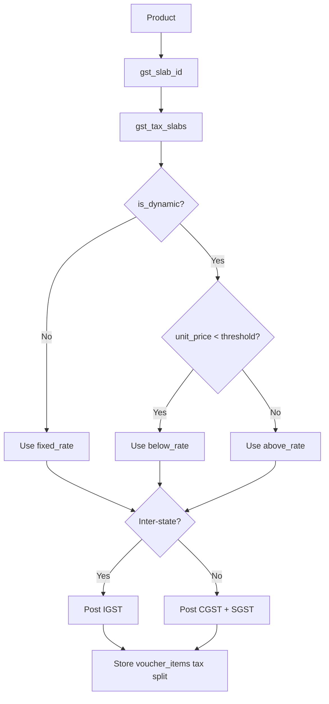

# GST Compatibility - Implementation Plan

## Background

Kola-biz currently stores transactions without any tax data. The goal is to add full India GST
compliance - CGST / SGST / IGST split, HSN/SAC codes on products, configurable GST slabs, party
GSTIN, Composition Scheme support, IRN placeholder, and a global enable/disable toggle in
Settings.

This implementation uses a slab-centered GST design:

- Price-threshold GST logic is stored on the slab, not on the product.
- Products only point to a GST category / slab.
- Fixed-rate and threshold-based GST rules are both centralized in `gst_tax_slabs`.
- The invoice engine dynamically resolves the effective rate from the selected slab and unit price.

The old generic `tax_rate` / `tax_amount` columns on `voucher_items` are deprecated
(not removed). New vouchers use the CGST/SGST/IGST columns exclusively.

---

## Core Decisions

| Topic | Decision |
|-------|----------|
| GST Slabs | 0%, 5%, 18%, 40%, plus dynamic slabs such as 5 / 18% @2500 |
| Price-threshold GST | Centralized in `gst_tax_slabs`, not `products` |
| Product tax model | Product stores only `gst_slab_id` and `hsn_sac_code` |
| Party address model | Use `address_line_1` to `address_line_4`, `city`, `state`, `postal_code`, `country`, `gstin` |
| GSTIN / State storage | Stored in `customers` / `suppliers` and synced to `chart_of_accounts` |
| COA account naming | Per effective rate, with both output and input ledgers, e.g. `CGST 2.5% Payable` and `CGST 2.5% Input Credit` |
| Composition Scheme | Supported |
| E-Invoice / IRN | IRN placeholder field added |
| TCS/TDS | Skipped for now |
| Tax-inclusive pricing | Global setting in Tax Settings page |
| Invoice template | New Tax Invoice template - format to be provided separately |
| Template context | Each line item gets its own CGST/SGST/IGST amounts plus header totals |
| Legacy transactions | No migration needed - existing transactions have no tax records |

---

## Implementation Scope

### 1 - Database / Schema (`db.rs`)

#### [MODIFY] [db.rs](/D:/My%20projects/Kola-biz/src-tauri/src/db.rs)

#### `gst_tax_slabs` table

We will combine fixed and dynamic GST behavior into a single slab table. The product only needs to
know which slab/category it belongs to.

```sql
CREATE TABLE IF NOT EXISTS gst_tax_slabs (
    id            TEXT PRIMARY KEY,
    name          TEXT NOT NULL,         -- e.g. "GST 5 / 18% @2500"
    is_dynamic    INTEGER DEFAULT 0,     -- 1 = threshold-based, 0 = fixed

    -- Used when is_dynamic = 0
    fixed_rate    REAL DEFAULT 0,

    -- Used when is_dynamic = 1
    threshold     REAL DEFAULT 0,        -- e.g. 2500.0
    below_rate    REAL DEFAULT 0,        -- e.g. 5.0
    above_rate    REAL DEFAULT 0,        -- e.g. 18.0

    is_active     INTEGER DEFAULT 1,
    created_at    DATETIME DEFAULT CURRENT_TIMESTAMP
);

INSERT OR IGNORE INTO gst_tax_slabs (id, name, is_dynamic, fixed_rate) VALUES
  ('gst_0',   'GST 0%',   0, 0),
  ('gst_5',   'GST 5%',   0, 5),
  ('gst_18',  'GST 18%',  0, 18),
  ('gst_40',  'GST 40%',  0, 40);

INSERT OR IGNORE INTO gst_tax_slabs (id, name, is_dynamic, threshold, below_rate, above_rate) VALUES
  ('gst_apparel', 'GST 5 / 18% @2500', 1, 2500.0, 5.0, 18.0);
```

#### Product schema simplification


| Table | New Column | Purpose |
|-------|-----------|----------|
| `products` | `hsn_sac_code TEXT` | HSN (goods) or SAC (services) code |
| `products` | `gst_slab_id TEXT` | Links to `gst_tax_slabs.id` |
| `customers` | `address_line_1 TEXT` | Customer address line 1 |
| `customers` | `address_line_2 TEXT` | Customer address line 2 |
| `customers` | `address_line_3 TEXT` | Customer address line 3 |
| `customers` | `address_line_4 TEXT` | Customer address line 4 |
| `customers` | `city TEXT` | Customer city |
| `customers` | `gstin TEXT` | Customer GSTIN |
| `customers` | `state TEXT` | Customer state |
| `customers` | `postal_code TEXT` | Customer postal code |
| `customers` | `country TEXT` | Customer country |
| `suppliers` | `address_line_1 TEXT` | Supplier address line 1 |
| `suppliers` | `address_line_2 TEXT` | Supplier address line 2 |
| `suppliers` | `address_line_3 TEXT` | Supplier address line 3 |
| `suppliers` | `address_line_4 TEXT` | Supplier address line 4 |
| `suppliers` | `city TEXT` | Supplier city |
| `suppliers` | `gstin TEXT` | Supplier GSTIN |
| `suppliers` | `state TEXT` | Supplier state |
| `suppliers` | `postal_code TEXT` | Supplier postal code |
| `suppliers` | `country TEXT` | Supplier country |
| `chart_of_accounts` | `address_line_1 TEXT` | Synced from customers/suppliers |
| `chart_of_accounts` | `address_line_2 TEXT` | Synced from customers/suppliers |
| `chart_of_accounts` | `address_line_3 TEXT` | Synced from customers/suppliers |
| `chart_of_accounts` | `address_line_4 TEXT` | Synced from customers/suppliers |
| `chart_of_accounts` | `city TEXT` | Synced from customers/suppliers |
| `chart_of_accounts` | `gstin TEXT` | Synced from customers/suppliers |
| `chart_of_accounts` | `state TEXT` | Synced from customers/suppliers |
| `chart_of_accounts` | `postal_code TEXT` | Synced from customers/suppliers |
| `chart_of_accounts` | `country TEXT` | Synced from customers/suppliers |
| `voucher_items` | `cgst_rate REAL DEFAULT 0` | CGST rate applied |
| `voucher_items` | `sgst_rate REAL DEFAULT 0` | SGST rate applied |
| `voucher_items` | `igst_rate REAL DEFAULT 0` | IGST rate applied |
| `voucher_items` | `cgst_amount REAL DEFAULT 0` | CGST amount per line |
| `voucher_items` | `sgst_amount REAL DEFAULT 0` | SGST amount per line |
| `voucher_items` | `igst_amount REAL DEFAULT 0` | IGST amount per line |
| `voucher_items` | `hsn_sac_code TEXT` | HSN/SAC snapshot at invoice time |
| `voucher_items` | `gst_slab_id TEXT` | Slab/category used |
| `voucher_items` | `resolved_gst_rate REAL DEFAULT 0` | Effective rate after slab resolution |
| `vouchers` | `irn TEXT` | E-Invoice Reference Number (manual entry) |
| `vouchers` | `irn_date DATE` | Date of IRN generation |

> [!IMPORTANT]
> Dynamic GST rules such as "5% below 2500, 18% at or above 2500" are configured on the slab
> itself. The invoice engine reads the linked slab, checks the line item's unit price, and resolves
> the final rate at runtime.

> [!NOTE]
> The old `tax_rate` / `tax_amount` columns on `voucher_items` are retained in the schema but
> ignored for new vouchers. New vouchers populate CGST/SGST/IGST columns only.

> [!NOTE]
> Existing generic `address` fields are not being migrated in this phase. New structured address
> fields will be added and used immediately for new and edited parties. Migration from `address`
> to `address_line_1` can be handled later.

#### GST account seeding

Accounting stays rate-based, not slab-name based. Dynamic slabs do not get separate ledger
accounts. They resolve to the existing accounts for the effective rate.

We should seed both:

- output tax accounts for sales transactions
- input tax credit accounts for purchase transactions

| Account Name | Type | Group | Used By |
|-------------|------|-------|---------|
| `CGST 2.5% Payable` | Output Tax | Duties & Taxes | Sales 5% |
| `SGST 2.5% Payable` | Output Tax | Duties & Taxes | Sales 5% |
| `IGST 5% Payable` | Output Tax | Duties & Taxes | Inter-state sales 5% |
| `CGST 9% Payable` | Output Tax | Duties & Taxes | Sales 18% |
| `SGST 9% Payable` | Output Tax | Duties & Taxes | Sales 18% |
| `IGST 18% Payable` | Output Tax | Duties & Taxes | Inter-state sales 18% |
| `CGST 20% Payable` | Output Tax | Duties & Taxes | Sales 40% |
| `SGST 20% Payable` | Output Tax | Duties & Taxes | Sales 40% |
| `IGST 40% Payable` | Output Tax | Duties & Taxes | Inter-state sales 40% |
| `CGST 2.5% Input Credit` | Input Tax Credit | Duties & Taxes | Purchases 5% |
| `SGST 2.5% Input Credit` | Input Tax Credit | Duties & Taxes | Purchases 5% |
| `IGST 5% Input Credit` | Input Tax Credit | Duties & Taxes | Inter-state purchases 5% |
| `CGST 9% Input Credit` | Input Tax Credit | Duties & Taxes | Purchases 18% |
| `SGST 9% Input Credit` | Input Tax Credit | Duties & Taxes | Purchases 18% |
| `IGST 18% Input Credit` | Input Tax Credit | Duties & Taxes | Inter-state purchases 18% |
| `CGST 20% Input Credit` | Input Tax Credit | Duties & Taxes | Purchases 40% |
| `SGST 20% Input Credit` | Input Tax Credit | Duties & Taxes | Purchases 40% |
| `IGST 40% Input Credit` | Input Tax Credit | Duties & Taxes | Inter-state purchases 40% |

> [!NOTE]
> Example: `GST 5 / 18% @2500` does not have its own ledger account. When the unit price is below
> 2500 it posts to the 5% ledgers. When the unit price is 2500 or above it posts to the 18%
> ledgers. This keeps the balance sheet and GST reporting clean.

---

### 2 - Backend Rust (`src-tauri/src/commands/`)

#### [NEW] `tax.rs` - GST Slab CRUD + Report Queries

Commands:

- `get_gst_tax_slabs` - list all slabs
- `create_gst_tax_slab` - add custom slab
- `update_gst_tax_slab` - update slab definition
- `delete_gst_tax_slab` - soft delete (prevent deleting slabs in use)
- `get_gstr1_summary(from_date, to_date)` - outward supplies grouped by HSN + resolved rate
- `get_gstr3b_summary(from_date, to_date)` - net output vs input credit

#### [NEW] `tax_utils.rs` - Dynamic GST resolution helper

```rust
pub struct ResolvedGst {
    pub rate: f64,
    pub cgst_amount: f64,
    pub sgst_amount: f64,
    pub igst_amount: f64,
}

pub fn calculate_dynamic_gst(
    unit_price: f64,
    qty: f64,
    slab: &GstTaxSlab,
    is_inter_state: bool
) -> ResolvedGst {
    let effective_rate = if slab.is_dynamic == 1 {
        if unit_price < slab.threshold {
            slab.below_rate
        } else {
            slab.above_rate
        }
    } else {
        slab.fixed_rate
    };

    let taxable_value = unit_price * qty;

    if is_inter_state {
        ResolvedGst {
            rate: effective_rate,
            igst_amount: (taxable_value * effective_rate) / 100.0,
            cgst_amount: 0.0,
            sgst_amount: 0.0,
        }
    } else {
        let split_rate = effective_rate / 2.0;
        let tax = (taxable_value * split_rate) / 100.0;
        ResolvedGst {
            rate: effective_rate,
            igst_amount: 0.0,
            cgst_amount: tax,
            sgst_amount: tax,
        }
    }
}
```

Additional helpers:

- `is_inter_state(...) -> Result<bool, String>`
- `resolve_gst_accounts(..., effective_rate, is_inter_state, is_purchase) -> Result<GstAccounts, String>`
- `resolve_effective_rate(unit_price, slab) -> f64`

`resolve_gst_accounts(...)` should:

- return payable accounts when `is_purchase == false`
- return input-credit accounts when `is_purchase == true`
- resolve by effective rate, not slab id alone

#### [MODIFY] `products.rs`

Update product create/update/read models to keep only:

- `hsn_sac_code: Option<String>`
- `gst_slab_id: Option<String>`

Remove product-level fields for:

- `gst_price_based`
- `gst_price_threshold`
- `gst_below_threshold_slab_id`
- `gst_above_threshold_slab_id`

#### [MODIFY] `parties.rs`

- Add these fields to customer/supplier create/update:
  - `address_line_1: Option<String>`
  - `address_line_2: Option<String>`
  - `address_line_3: Option<String>`
  - `address_line_4: Option<String>`
  - `city: Option<String>`
  - `state: Option<String>`
  - `postal_code: Option<String>`
  - `country: Option<String>`
  - `gstin: Option<String>`
- On save: write to both `customers`/`suppliers` and sync the same fields to `chart_of_accounts`.
- Keep existing generic `address` untouched for now. No migration is included in this phase.

#### [MODIFY] `invoices.rs` + `sales_returns.rs` + `purchase_returns.rs`

Updated invoice save flow:

1. Read `gst_enabled` from `app_settings`.
2. If disabled -> all GST fields = 0 and skip GST journal entries.
3. If enabled:
   - Read `gst_registration_type` (`Regular` / `Composition` / `Unregistered`).
   - Load company state from `company_profile`.
   - Load party state from `chart_of_accounts`.
   - Detect inter-state: `company_state != party_state`.
4. In `Regular` mode, for each line item:
   - Load product.
   - Load product's linked `gst_tax_slabs` row using `product.gst_slab_id`.
   - Resolve the effective rate from the slab and current `unit_price`.
   - Calculate CGST/SGST or IGST based on state comparison.
   - Store GST split columns, `gst_slab_id`, and `resolved_gst_rate` on `voucher_items`.
   - Post journal entries to the ledger accounts for the effective rate.
   - Use payable accounts for sales flows and input-credit accounts for purchase flows.
5. In `Composition` mode:
   - Do not collect per-line GST from the customer.
   - Post flat composition tax to `Composition Tax Payable`.
6. Add `irn` and `irn_date` to voucher header if provided.

Pseudo-flow:

```text
product -> gst_slab_id -> gst_tax_slabs row

if slab.is_dynamic == 1:
    effective_rate = below_rate if unit_price < threshold else above_rate
else:
    effective_rate = fixed_rate

if inter_state:
    use IGST
else:
    split into CGST + SGST
```

#### [MODIFY] `settings.rs`

`get_gst_settings()` reads:

- `gst_enabled`
- `gst_registration_type`
- `gst_tax_inclusive`
- `composition_rate`

`save_gst_settings()` upserts the same keys.

#### [MODIFY] `mod.rs`

- Register new `tax` module and commands.

#### [MODIFY] `lib.rs`

- Add new commands to Tauri `.invoke_handler`.

---

### 3 - Frontend (`src/`)

#### [MODIFY] `src/pages/ProductsPage.tsx`

The product UI becomes simpler.

- Add `HSN/SAC Code` field.
- Replace product-level GST threshold configuration with a single `GST Category` dropdown.
- Dropdown options come from `gst_tax_slabs`, for example:
  - `GST 0%`
  - `GST 5%`
  - `GST 18%`
  - `GST 40%`
  - `GST 5 / 18% @2500`
- Remove checkboxes and fields related to product-level "Price Based" logic.

#### [MODIFY] `src/pages/SalesInvoicePage.tsx`

Dynamic behavior now happens here in real time.

- User selects a product.
- Product provides `gst_slab_id`.
- User enters a unit price.
- Frontend loads the selected slab and computes the effective display rate immediately.

Frontend behavior:

- If `selectedSlab.is_dynamic === 1`:
  - Compare `unit_price` with `selectedSlab.threshold`.
  - Show the resolved rate instantly, for example `5%` or `18%`.
  - Show a small badge such as `Threshold Applied`.
- If `selectedSlab.is_dynamic === 0`:
  - Show the fixed rate directly.
- Continue switching tax display between `IGST` and `CGST + SGST` based on party state.

#### [MODIFY] `src/pages/PurchaseInvoicePage.tsx`

- Same slab resolution behavior as sales invoices.
- Effective rate is derived from the linked slab and line price in real time.

#### [NEW] `src/pages/settings/TaxSettingsPage.tsx`

This page becomes the management surface for named GST categories/slabs.

Section 1 - GST Configuration

- Enable GST
- Registration Type: `Regular` / `Composition` / `Unregistered`
- Composition Rate %
- Tax Inclusive / Tax Exclusive toggle

Section 2 - GST Categories / Slabs

- List all slab records from `gst_tax_slabs`
- Create a category
- Edit a category
- Deactivate a category

Category form:

- Name
- Type: `Fixed` or `Price-Based`
- If `Fixed`:
  - `fixed_rate`
- If `Price-Based`:
  - `threshold`
  - `below_rate`
  - `above_rate`

Section 3 - GST Accounts Overview

- Read-only list of accounts generated for effective rates
- Show both output/payable and input/input-credit accounts
- Clarify that dynamic slabs map to existing rate-ledgers rather than unique ledgers

#### [MODIFY] `src/pages/CustomersPage.tsx` + `src/pages/SuppliersPage.tsx`

- Replace generic address input with:
  - `Address Line 1`
  - `Address Line 2`
  - `Address Line 3`
  - `Address Line 4`
  - `City`
  - `State`
  - `Postal Code`
  - `Country`
  - `GSTIN`
- Add GSTIN field validation
- Add State selector
- Use the structured fields for all new and edited party records
- Do not migrate old `address` data in this phase

#### [MODIFY] `src/pages/SalesReturnPage.tsx` + `src/pages/PurchaseReturnPage.tsx`

- Reuse the same slab-based GST resolution as invoices

#### [NEW] `src/pages/reports/GSTReportPage.tsx`

Two sub-views:

1. GSTR-1 Summary - grouped by HSN + resolved rate
2. GSTR-3B Summary - input credit vs output liability

#### [MODIFY] `src/App.tsx`

- Add route for `/settings/tax`
- Add route for `/reports/gst`

#### [MODIFY] `src/store/index.ts`

- Add `gstEnabled: boolean`
- Add `gstSlabs: GstSlab[]`
- Load GST settings and slab definitions on startup

---

### 4 - Accounting and Journal Entries

The posting model should be based on the effective rate, not the slab name.
It should support both sales tax liability and purchase input credit.

Examples:

- A fixed `GST 5%` slab posts to 5% GST ledgers.
- A dynamic `GST 5 / 18% @2500` slab posts to:
  - 5% ledgers when `unit_price < 2500`
  - 18% ledgers when `unit_price >= 2500`

Sales use payable ledgers. Purchases use input-credit ledgers.

This keeps:

- balance sheet accounts clean
- GST returns simpler
- account seeding reusable across both fixed and dynamic categories

Suggested journal-account mapping:

| Flow | Effective Rate | Intra-state | Inter-state |
|------|----------------|------------|-------------|
| Sales | 5% | `CGST 2.5% Payable` + `SGST 2.5% Payable` | `IGST 5% Payable` |
| Sales | 18% | `CGST 9% Payable` + `SGST 9% Payable` | `IGST 18% Payable` |
| Sales | 40% | `CGST 20% Payable` + `SGST 20% Payable` | `IGST 40% Payable` |
| Purchases | 5% | `CGST 2.5% Input Credit` + `SGST 2.5% Input Credit` | `IGST 5% Input Credit` |
| Purchases | 18% | `CGST 9% Input Credit` + `SGST 9% Input Credit` | `IGST 18% Input Credit` |
| Purchases | 40% | `CGST 20% Input Credit` + `SGST 20% Input Credit` | `IGST 40% Input Credit` |

---

### 5 - Invoice Template (`templates.rs` / HTML templates)

#### [MODIFY] `src-tauri/src/commands/templates.rs`

Expanded template context should include both the selected slab and the resolved rate:

```json
{
  "gst_enabled": true,
  "is_inter_state": false,
  "company_gstin": "29ABCDE1234F1Z5",
  "party_gstin": "32XYZAB5678G1Z3",
  "party_address_line_1": "12 Market Road",
  "party_address_line_2": "Near Textile Circle",
  "party_address_line_3": "Industrial Area",
  "party_address_line_4": "",
  "party_city": "Kochi",
  "party_state": "Kerala",
  "party_postal_code": "682001",
  "party_country": "India",
  "place_of_supply": "Kerala",
  "irn": "abc123...",
  "irn_date": "2026-04-15",
  "cgst_total": 900.00,
  "sgst_total": 900.00,
  "igst_total": 0.00,
  "total_tax": 1800.00,
  "grand_total": 11800.00,
  "items": [
    {
      "product_name": "Apparel Item",
      "hsn_sac_code": "6109",
      "gst_slab_id": "gst_apparel",
      "gst_slab_name": "GST 5 / 18% @2500",
      "resolved_gst_rate": 18.0,
      "taxable_amount": 10000.00,
      "cgst_rate": 9.0,
      "cgst_amount": 900.00,
      "sgst_rate": 9.0,
      "sgst_amount": 900.00,
      "igst_rate": 0.0,
      "igst_amount": 0.00,
      "total_tax_amount": 1800.00
    }
  ]
}
```

#### [NEW] Tax Invoice Template

A dedicated Tax Invoice HTML template will be created once the final layout is provided. It should
include:

- GSTIN in company and party headers
- Structured party address lines from `address_line_1` to `address_line_4`
- City, state, postal code, and country
- `Tax Invoice` title
- Place of Supply
- HSN/SAC column
- Per-item tax columns
- Tax breakup footer
- IRN and QR placeholder
- Visible indication when a dynamic slab resolved to a specific rate

---

## Architecture Overview



---

## Verification Plan

### Automated

```powershell
cargo build --manifest-path D:\My projects\Kola-biz\src-tauri\Cargo.toml
```

### Manual UI Verification

1. Go to Tax Settings and confirm seeded slabs include fixed rates and `GST 5 / 18% @2500`.
2. Create a product with HSN code and GST Category = `GST 5 / 18% @2500`.
3. Create a sales invoice with unit price below 2500 and verify the UI resolves to 5%.
4. Change the same line item's unit price to 2500 or higher and verify the UI resolves to 18%.
5. Verify the `Threshold Applied` indicator appears for the dynamic slab.
6. Create an intra-state invoice and confirm CGST + SGST split.
7. Create an inter-state invoice and confirm IGST is used instead.
8. Verify journal entries post to 5% ledgers for low-price lines and 18% ledgers for high-price lines.
9. Disable GST and confirm tax columns are hidden and tax amounts are zeroed.

### Regression

- Create invoices and returns with both fixed and dynamic slabs.
- Verify reports group values by HSN and resolved rate correctly.
- Verify legacy transactions continue to load without requiring migration.
